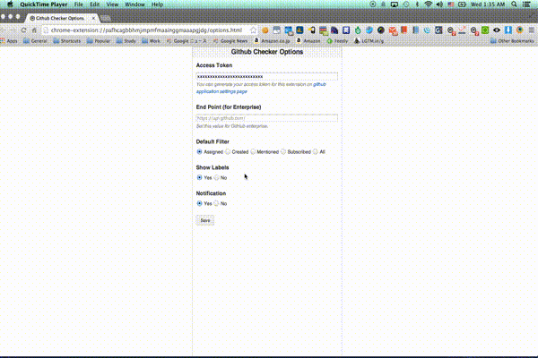

# issue-checker-for-github

[][store]

A Chrome extension to check GitHub issues assigned to you.

# Screenshot



# How to develop

Firstly, load the `app` directory directly onto (extension management page)[chrome://extensions/].

Then, start watching the `src` directory to compile the assets automatically.

```bash
grunt watch
```

Or you can compile them by yourself as well.

```bash
grunt compile
```

# How to pack

```bash
grunt pack
```

[store]: https://chrome.google.com/webstore/detail/issue-checker-for-github/dejgifcjoefbogdjpjokobdlddjhbich
